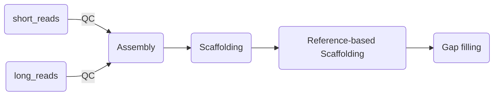

# HSCG


## 1 Introduction

HSCG(Hybrid, Scaffold, Chromosomer, Gap-fill) is a hybrid assembly pipeline using short reads and long reads.



The HSCG software program is freely available. If you use HSCG and publish your analysis, please report the program version and cite
the appropriate publication:

Du, H., Diao, C., Zhao, P., Zhou, L., & Liu, J. F. (2021). Integrated hybrid de novo assembly technologies to obtain high-quality pig genome using short and long reads. Briefings in Bioinformatics, 22(5), bbaa399.

[doi:10.1093/bib/bbaa399](https://doi.org/10.1093/bib/bbaa399)

## 2 Installation

Running HSCG requires a Linux-system with bash, Python3(>3.6) and Perl(>5.16). 


### 2.1 Python Dependencies


The following Python modules need to be installed:

* `biopython`
* `Networkx`  == 1.7
* `pyparsing`
* `numpy`
* `h5py`
* `pysam`
* `intervaltree`


The following software should also be installed in the same PYTHONPATH

* [cutadapt](https://github.com/marcelm/cutadapt)
* [RaGoo](https://github.com/malonge/RaGOO)


We recommend you create a virtual python environment.


```shell
mkvirtualenv HSCG
pip install biopython Networkx==1.7 pyparsing numpy h5py pysam intervaltree cutadapt

cd <PATH TO RAGOO>
python setup.py install
```


### 2.2 Assembly Dependencies

HSCG establishes a pipeline based on several bioinformatic softwares. These softwares need to be installed before running the pipeline.

* [FastQC](https://github.com/s-andrews/FastQC) : Neccessary for TrimGalore.

* [TrimGalore](https://github.com/FelixKrueger/TrimGalore) : Short reads quality control.
* [LoRDEC](http://www.atgc-montpellier.fr/lordec/) : Correct sequencing errors in long reads from 3rd generation sequencing with high error rate.
* [DBG2OLC](https://github.com/yechengxi/DBG2OLC) : The genome assembler.
* [PBJelly2](https://sourceforge.net/p/pb-jelly/wiki/Home/) : A highly automated pipeline that aligns long sequencing reads (such as PacBio RS reads or long 454 reads in fasta format) to high-confidence draft assembles.
* [SSPACE-LongRead](https://hpc.ilri.cgiar.org/sspace-longread-software) : A stand-alone program for scaffolding pre-assembled contigs using long reads.
* [TGS_GapCloser](https://github.com/BGI-Qingdao/TGS-GapCloser) : A gap-closing software tool that uses long reads to enhance genome assembly.
* [LR_Gapcloser](https://github.com/CAFS-bioinformatics/LR_Gapcloser) : Use long sequenced reads to close gaps in assemblies.


**However, some softwares cause conflicts because of version of Python/Perl. For convienience, we revise theses scripts and package them in our project. We recommend the revised version.**

revised software download: [https://github.com/CAU-TeamLiuJF/HSCG_testdata](https://github.com/CAU-TeamLiuJF/HSCG_testdata)

download `src` and put the directory in HSCG.

```shell
cd src
bash compile_pipeline.sh
```

You can add them to your ~/.bashrc or just source the script:

```shell
source source_env.sh
```


After installation, the parent directory should be like:

```shell
HSCG
|
|---bin
|---hscg
|---src
|
|-----hscg_pipeline.py
|-----source_env.sh
```


## 3 Usage

Before running the pipeline, environment should be activated:

```shell
workon HSCG
source source_env.sh
```

Details of HSCG pipeline:

```
usage: hscg_pipeline.py [-h] [--config] [--run] [-v]

Genome Assembly Pipeline
Scaffolding options: PBJELLY2, SSPACELongRead
Gap Filling options: TGS_GapCloser, LR_Gapcloser

optional arguments:
  -h, --help     show this help message and exit
  --config       Generate configuration files for assembly pipeline.
  --run          Running the assembly pipeline.
  -v, --version  show program's version number and exit
```

**Note 1 : Scaffolding [method_type] has two options: PBJELLY2, SSPACELongRead**  

**Note 2 : Gap Filling [method_type] has two options: TGS_GapCloser, LR_Gapcloser**  

**Note 3 : Files in [data] should exist. If you don't need it, you can create an empty file.**  


The data sections in opt.ini is as follow:

```shell
[data]
short_reads_file = 
short_reads_paired = 1
long_reads_file = 
reference_file = 
assembly = 
```

**Note 1: If paired, short_reads_file should be splitted by comma**

**Note 2: [short_reads_file], [long_reads_file], [reference_file] need existed file (can be empty)**


## 4 Example

To test the pipeline, you can download the test data from our FTP: 

[https://github.com/CAU-TeamLiuJF/HSCG_testdata](https://github.com/CAU-TeamLiuJF/HSCG_testdata)


### 4.1 Common use

**Generate configuration files**

```shell
hscg_pipeline.py --config
```

Three configurations will be created:

* **opt.ini:** Define which step to use.
* **bopt.ini**: Define the path of softwares.
* **parameters.ini:** Define the operation parameters of each step.


**Run genome assembly pipeline**

```shell
hscg_pipeline.py --run
```


### 4.2 Use some specific modules

* only short reads quality control

```
# opt.ini
[data]
short_reads_file = Illumina.R1.fq,Illumina.R2.fq
short_reads_paired = 1
long_reads_file = Pacbio_01.fasta / an empty fasta
reference_file = ALAV01.fasta / an empty fasta
assembly = 

[short_read]
need_clean = 1
workdir = short_reads_qc

[long_read]
need_clean = 0
workdir = long_reads_correct

[assembly]
need = 0
workdir = assembly

[scaffolding]
need = 0
method_type = PBJELLY2
workdir = scaffolding

[scaffolding_ref_based]
need = 0
workdir = scaffolding_ref_based

[gap_filling]
method_type = TGS_GapCloser
need = 0
workdir = gap_filling
```

* only assembly

```
# opt.ini
[data]
short_reads_file = Illumina.R1.fq,Illumina.R2.fq
short_reads_paired = 1
long_reads_file = Pacbio_01.fasta
reference_file = ALAV01.fasta
assembly = 

[short_read]
need_clean = 0
workdir = short_reads_qc

[long_read]
need_clean = 0
workdir = long_reads_correct

[assembly]
need = 1
workdir = assembly

[scaffolding]
need = 0
method_type = PBJELLY2
workdir = scaffolding

[scaffolding_ref_based]
need = 0
workdir = scaffolding_ref_based

[gap_filling]
method_type = TGS_GapCloser
need = 0
workdir = gap_filling
```

* only gap filling

```shell
# opt.ini
[data]
short_reads_file = Illumina.R1.fq,Illumina.R2.fq
short_reads_paired = 1
long_reads_file = Pacbio_01.fasta
reference_file = ALAV01.fasta / an empty file
assembly = assembly.fasta

[short_read]
need_clean = 0
workdir = short_reads_qc

[long_read]
need_clean = 0
workdir = long_reads_correct

[assembly]
need = 0
workdir = assembly

[scaffolding]
need = 0
method_type = PBJELLY2
workdir = scaffolding

[scaffolding_ref_based]
need = 0
workdir = scaffolding_ref_based

[gap_filling]
method_type = TGS_GapCloser
need = 1
workdir = gap_filling
```

* short-reads quality control + long reads correction + assembly

```
# opt.ini
[data]
short_reads_file = Illumina.R1.fq,Illumina.R2.fq
short_reads_paired = 1
long_reads_file = Pacbio_01.fasta
reference_file = ALAV01.fasta / an empty file
assembly = 

[short_read]
need_clean = 1
workdir = short_reads_qc

[long_read]
need_clean = 1
workdir = long_reads_correct

[assembly]
need = 1
workdir = assembly

[scaffolding]
need = 0
method_type = PBJELLY2
workdir = scaffolding

[scaffolding_ref_based]
need = 0
workdir = scaffolding_ref_based

[gap_filling]
method_type = TGS_GapCloser
need = 0
workdir = gap_filling
```

